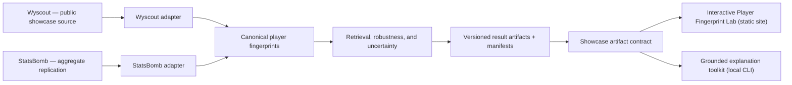

# Yumusarái Labs — Evidence-first Player Fingerprints

[](https://github.com/grunobuide/scoutlens/actions/workflows/tests.yml)

**Live: [grunobuide.github.io/scoutlens](https://grunobuide.github.io/scoutlens/)**
 · [Case study](docs/case-study.md) · [How it works](https://grunobuide.github.io/scoutlens/science/)

Yumusarái Labs is a research-backed portfolio project for building, testing, and
explaining statistical fingerprints of football players from event data.
It combines reproducible data engineering, deliberately simple baselines,
external replication, uncertainty-aware evaluation, and an interactive
Player Fingerprint Lab.

The feasibility phase is complete: **event-derived profiles contain a stable
individual fingerprint worth turning into a flagship experience.** The project
does not claim that statistical similarity proves playing style, recommends a
signing, or predicts transfer success.

### Two names, on purpose

The published name is **Yumusarái Labs**. Everything a machine resolves is still
`scoutlens`: this repository and its URL, the Python package and its imports,
the `SCOUTLENS_*` environment variables, the `scoutlens.showcase/2.0.0` artifact
contract, the dataset pins and the release tags.

That is not half a rename waiting to be finished. Renaming any of them would
break a published deep link, a release-asset URL, a fail-closed contract string
validated at the web boundary, or a reproduction command printed further down
this page. One occurrence is even visible on the site itself — the provenance
note rendered on every route comes from a content-addressed artifact whose
digest is pinned and already published, so rewording it would change the
dataset identity this project's own numbers are quoted against.

The boundary is frozen in
[`docs/public-identity-contract.md`](docs/public-identity-contract.md), with the
reasoning in `D058` of the [decisions log](docs/decisions-log.md).

## Why this project is interesting

Yumusarái Labs is not a story about adding the most complex model available. It is
a record of scientific decisions under imperfect real-world data:

- A 32-feature cosine baseline recovered the same player's second-half profile
  far better than a role-and-minutes heuristic on Wyscout 2017/18.
- A stronger team-aware control exposed a major same-season experimental
  confound and forced a narrower interpretation of the result.
- The core fingerprint signal replicated on StatsBomb 2015/16 with a different
  provider, season, league set, and 28-feature canonical mapping — at a smaller
  magnitude, reported as such.
- A ratio-shrinkage experiment fixed an obvious low-sample pathology but did
  not improve retrieval, so it was not promoted into the default catalog.

That sequence — result, challenge, correction, replication, and a documented
null — is the central evidence behind the project.

## Evidence at a glance

| Experiment | Simple baseline MRR | Fingerprint MRR | Honest interpretation |
|---|---:|---:|---|
| Wyscout 2017/18, 1,257 eligible player×competition units | 0.0256 | **0.2539** | Strong temporal fingerprint; about 10× the role+minutes baseline |
| Wyscout, candidate pool restricted within nominal role | 0.0256 | **0.2787** | Signal is not only a position classifier |
| StatsBomb 2015/16, 1,061 eligible units | 0.0381 | **0.2031** | External replication at lower magnitude; about 5.3× |
| Wyscout ratios: raw vs empirical-Bayes shrinkage | — | 0.2539 vs 0.2512 | Pathology fixed per feature, no material retrieval gain |
| Wyscout, chance-level control (lift over uniform-target floor) | 4.2× | **41.4×** | Signal is 41× above design luck globally, 38.9× for transferred players; the role+team baseline collapses to 1.6× there |

The important caveat travels with every headline: a role+team+minutes baseline
reaches MRR 0.589 on Wyscout and 0.602 on StatsBomb because most eligible
players do not change club mid-season. On transferred players that shortcut
collapses; the Wyscout feature result remains encouraging at `n=26`, while the
StatsBomb effect remains inconclusive at `n=19`.

Start with the [feasibility report](docs/feasibility-report.md), then read the
[robustness checks](docs/robustness-checks.md),
[transfer analysis](docs/transfer-analysis.md),
[StatsBomb replication](docs/statsbomb-replication.md), and the
[chance-level control](docs/chance-level-control.md) that pins every MRR to
the design's uniform-target floor.

## Architecture

Two provider-scoped ingestion and feature pipelines feed a provider-agnostic
evaluation layer. Small result artifacts carry their config, code revision,
environment, and input hashes. The web experience consumes a separate, versioned
showcase contract rather than recomputing research logic in the browser.



The AI toolkit reads the same published contract and runs **locally, on a
developer's machine**. It is deliberately not wired into the site: there is no
AI in the public UI, none is planned, and the deployed pages make no network
call to any model.

See [docs/architecture.md](docs/architecture.md) for current boundaries,
planned components, data licensing, reproducibility, and the AI trust model.
The implementation boundary is now frozen in the
[vertical-slice specification](docs/flagship-vertical-slice.md) and the
[versioned showcase artifact contract](docs/showcase-artifact-contract.md).

## Reproduce the research

Requires Python 3.11+ and [uv](https://docs.astral.sh/uv/). CI tests the
supported floor (3.11) and the current development runtime (3.14).

```bash
uv sync --frozen --all-groups
```

### Wyscout / Pappalardo pipeline

```bash
uv run python -m scoutlens.data.ingestion
uv run python -m scoutlens.data.minutes
uv run python -m scoutlens.data.validation

uv run python -m scoutlens.evaluation.run_report
uv run python -m scoutlens.evaluation.run_robustness
uv run python -m scoutlens.evaluation.run_transfer_analysis
uv run python -m scoutlens.evaluation.run_shrinkage_experiment

# Build, validate, and atomically publish scoutlens.showcase/1.0.0.
uv run python -m scoutlens.showcase.export
```

The showcase exporter consumes the local processed Wyscout Parquets and the
five checked-in research summaries. It writes `public/showcase/v1`, validates
all schemas, cross-artifact references and checksums, and fails before replacing
an existing export if any invariant or gzip budget is violated. The reviewable
manifest, feature catalog, player index, and research summary are versioned in
Git. The reproducible 1,257-file player payload directory is excluded from Git
because its compact JSON totals about 147 MB. A clean clone hydrates the complete
content-addressed payload from its pinned release asset without provider data:

```bash
uv run --frozen python -m scoutlens.showcase.payload hydrate
```

The command verifies the archive digest, exact manifest path set, and every
profile checksum before atomically publishing `players/`. Offline rebuilds,
the immutable asset identity, and the licence boundary are documented in
[Showcase payload distribution](docs/showcase-payload-pack.md).

### StatsBomb external replication

The pinned four-league ingestion is approximately 5 GB. Review
[StatsBomb provenance and licence constraints](docs/statsbomb-provenance.md)
before running it.

```bash
uv run python -m scoutlens.statsbomb.ingestion
uv run python -m scoutlens.statsbomb.replication
```

### Quality and drift gates

```bash
uv run --frozen pytest -q
uv run --frozen ruff check .
uv run --frozen mypy src/scoutlens
uv build

# Requires both local processed datasets; recomputes all six result sets.
SCOUTLENS_DRIFT=1 uv run --frozen pytest tests/evaluation/test_artifact_drift.py
```

## Local AI explanations

Four sections, permitted by `D057` for setup, CLI usage, adapter configuration
and status. They describe how to run the tool. They restate no result: the
numbers live in [`docs/ai-eval-method.md`](docs/ai-eval-method.md) and in the
report it describes.

### AI setup

No extra dependency, no credential, no account. The toolkit is part of the
package and its default path is offline.

```bash
uv sync --frozen --all-groups
uv run --frozen python -m scoutlens.showcase.payload hydrate
```

There is no AI anywhere in the published website, and nothing here runs in a
browser or a backend. It is a local command-line tool.

### CLI usage

Generate one grounded explanation of a published profile, with no model:

```bash
uv run --frozen python -m scoutlens.explanations.cli explain --profile wy-8287-c-795
```

The default explainer builds the explanation the bundle supports, directly from
the bundle, and the output says so. Its purpose is to show the contract is
satisfiable and to set the bar a model is then held to — the same validator, no
exemption for being a model.

```bash
# valid profile keys to try
uv run --frozen python -m scoutlens.explanations.cli profiles --limit 10

# the full record, including provenance and telemetry
uv run --frozen python -m scoutlens.explanations.cli explain --profile wy-8287-c-795 --format json

# reproduce the committed evaluation report without writing it
uv run --frozen python -m scoutlens.explanations.evals.run_report --check
```

Exit codes: `0` validated, `1` the generated answer was refused and the
deterministic fallback was returned, `2` artifacts missing, `3` usage error,
`4` an adapter tried to reach the network while offline. A refused answer is
never printed, written or persisted.

Full walkthrough: [`docs/ai-explanation-cli.md`](docs/ai-explanation-cli.md).

### Adapter configuration

An adapter is any object with `adapter_id`, `adapter_version`, `model_id` and
`complete(request)` — nothing provider-specific. Point the CLI at a
zero-argument factory and nothing in this repository needs editing:

```bash
uv run --frozen python -m scoutlens.explanations.cli conformance --adapter mypackage.myadapter:build
uv run --frozen python -m scoutlens.explanations.cli explain     --profile wy-8287-c-795 --adapter mypackage.myadapter:build --online
```

`--online` is required for any network access and is enforced rather than
promised: on the default path a socket attempt fails. Credentials are read only
from `SCOUTLENS_MODEL_API_KEY` in the environment — there is no flag that
carries one, because arguments land in shell history, `ps` output and CI logs.

The shipped reference adapter speaks the OpenAI-compatible wire format to any
`base_url` you configure (llama.cpp, vLLM, Ollama, a hosted service), with no
provider SDK in the base runtime. See
[`docs/ai-adapter-guide.md`](docs/ai-adapter-guide.md).

### AI status

Delivered: the explanation contract and its validator, the provider-neutral
adapter boundary with a conformance suite, the evaluation corpus and its
preregistered gate, the deterministic fallback, and this CLI.

Not delivered: **no demonstration model has been evaluated.** The live harness,
the preregistered threshold and the drop rule all exist and are tested, but no
model has been run against them, so the live gate records `not_run` — which is
deliberately distinct from a pass. Anyone with an endpoint can close that loop
with `run_live`; until someone does, this project makes no claim about any
model's behaviour.


## Read the research trail

1. [Final feasibility report](docs/feasibility-report.md) — claims, results,
   limitations, and gate decision.
2. [Frozen original brief](docs/00_ScoutLens_Project_Brief_v1.md) and
   [project charter](docs/project-charter.md) — the question asked before the
   result was known.
3. [Decisions log](docs/decisions-log.md) — append-only changes and their
   reasoning.
4. [Feature definitions](docs/feature-definitions.md),
   [minutes derivation](docs/minutes-derivation.md), and
   [data quality](docs/data-quality-report.md) — analytical foundations.
5. [StatsBomb compatibility](docs/statsbomb-feature-compatibility.md),
   [pipeline](docs/statsbomb-pipeline.md), and
   [replication](docs/statsbomb-replication.md) — external-validity path.
6. [Shrinkage experiment](docs/shrinkage-experiment.md) — a documented null
   and keep/drop decision.
7. [Chance-level control](docs/chance-level-control.md) — every MRR pinned to
   the design's uniform-target floor (the absolute scale for "above chance").
8. [Recruitment study harness](docs/recruitment-study-harness.md) — a complete
   optional human-study harness, now deferred because recruitment usefulness
   is not required for the portfolio flagship claim.
9. [Flagship vertical slice](docs/flagship-vertical-slice.md) and
   [showcase artifact contract](docs/showcase-artifact-contract.md) — the public
   product cut, evidence behavior, typed Python/web boundary, and acceptance
   budgets.

## Repository map

```text
config/                         versioned experiment parameters
src/scoutlens/data/             Wyscout ingestion, minutes, validation
src/scoutlens/features/         Wyscout feature catalog and shrinkage
src/scoutlens/statsbomb/        provider-scoped StatsBomb pipeline
src/scoutlens/evaluation/       provider-agnostic retrieval and robustness
src/scoutlens/showcase/         versioned public artifact builders and validators
web/                            static Next.js showcase and typed artifact consumer
src/scoutlens/study/            optional blinded human-study harness
tests/                          unit, integration, snapshot, and drift tests
artifacts/                      six versioned result summaries; raw data excluded
public/showcase/v1/             generated public contract, index, evidence, and profiles
docs/                           methods, provenance, decisions, results, architecture
```

The static web foundation, the public showcase contract, the interactive Lab,
the uncertainty layer and the grounded-explanation toolkit are delivered and
deployed. What is **not** delivered is a demonstration model: the evaluation
harness and its preregistered threshold exist and are tested, but no model has
been run against them, so the live gate records `not_run` and this project makes
no claim about any model's behaviour.

This repository contains the project and what is needed to run it after a
clone. The agent/orchestration tooling used during development (issue tracker,
agent pool, personas, per-tool configs) lives in a separate template and is
deliberately not versioned here.

## Data licences

- **Wyscout/Pappalardo:** CC BY 4.0. The public flagship dataset will use only
  attributed, derived Wyscout aggregates.
- **StatsBomb Open Data:** non-commercial, no raw-data redistribution, and logo
  attribution required for published analysis. Yumusarái Labs exposes StatsBomb only
  as aggregate replication evidence; raw and per-player derived tables remain
  local.
- **This repository's code:** [MIT](LICENSE). The MIT licence covers the code here,
  not third-party data or analyses with additional source restrictions.

See [DATA_LICENSES.md](DATA_LICENSES.md) for the complete attribution and usage
boundary.
