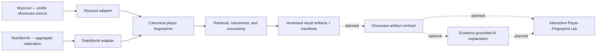

# ScoutLens — Evidence-first Player Fingerprints

[](https://github.com/grunobuide/scoutlens/actions/workflows/tests.yml)

ScoutLens is a research-backed portfolio project for building, testing, and
explaining statistical fingerprints of football players from event data.
It combines reproducible data engineering, deliberately simple baselines,
external replication, uncertainty-aware evaluation, and a planned interactive
Player Fingerprint Lab.

The feasibility phase is complete: **event-derived profiles contain a stable
individual fingerprint worth turning into a flagship experience.** The project
does not claim that statistical similarity proves playing style, recommends a
signing, or predicts transfer success.

## Why this project is interesting

ScoutLens is not a story about adding the most complex model available. It is
a record of scientific decisions under imperfect real-world data:

- A 32-feature cosine baseline recovered the same player's second-half profile
  far better than a role-and-minutes heuristic on Wyscout 2017/18.
- A stronger team-aware control exposed a major same-season experimental
  confound and forced a narrower interpretation of the result.
- The core fingerprint signal replicated on StatsBomb 2015/16 with a different
  provider, season, league set, and 28-feature canonical mapping — at a smaller
  magnitude, reported as such.
- A ratio-shrinkage experiment fixed an obvious low-sample pathology but did
  not improve retrieval, so it was not promoted into the default catalog.

That sequence — result, challenge, correction, replication, and a documented
null — is the central evidence behind the project.

## Evidence at a glance

| Experiment | Simple baseline MRR | Fingerprint MRR | Honest interpretation |
|---|---:|---:|---|
| Wyscout 2017/18, 1,257 eligible player×competition units | 0.0256 | **0.2539** | Strong temporal fingerprint; about 10× the role+minutes baseline |
| Wyscout, candidate pool restricted within nominal role | 0.0256 | **0.2787** | Signal is not only a position classifier |
| StatsBomb 2015/16, 1,061 eligible units | 0.0381 | **0.2031** | External replication at lower magnitude; about 5.3× |
| Wyscout ratios: raw vs empirical-Bayes shrinkage | — | 0.2539 vs 0.2512 | Pathology fixed per feature, no material retrieval gain |

The important caveat travels with every headline: a role+team+minutes baseline
reaches MRR 0.589 on Wyscout and 0.602 on StatsBomb because most eligible
players do not change club mid-season. On transferred players that shortcut
collapses; the Wyscout feature result remains encouraging at `n=26`, while the
StatsBomb effect remains inconclusive at `n=19`.

Start with the [feasibility report](docs/feasibility-report.md), then read the
[robustness checks](docs/robustness-checks.md),
[transfer analysis](docs/transfer-analysis.md), and
[StatsBomb replication](docs/statsbomb-replication.md).

## Architecture

Two provider-scoped ingestion and feature pipelines feed a provider-agnostic
evaluation layer. Small result artifacts carry their config, code revision,
environment, and input hashes. The flagship web experience will consume a
separate, versioned showcase contract rather than recomputing research logic in
the browser.



See [docs/architecture.md](docs/architecture.md) for current boundaries,
planned components, data licensing, reproducibility, and the AI trust model.
The implementation boundary is now frozen in the
[vertical-slice specification](docs/flagship-vertical-slice.md) and the
[versioned showcase artifact contract](docs/showcase-artifact-contract.md).

## Reproduce the research

Requires Python 3.11+ and [uv](https://docs.astral.sh/uv/). CI tests the
supported floor (3.11) and the current development runtime (3.14).

```bash
uv sync --frozen --all-groups
```

### Wyscout / Pappalardo pipeline

```bash
uv run python -m scoutlens.data.ingestion
uv run python -m scoutlens.data.minutes
uv run python -m scoutlens.data.validation

uv run python -m scoutlens.evaluation.run_report
uv run python -m scoutlens.evaluation.run_robustness
uv run python -m scoutlens.evaluation.run_transfer_analysis
uv run python -m scoutlens.evaluation.run_shrinkage_experiment

# Build, validate, and atomically publish scoutlens.showcase/1.0.0.
uv run python -m scoutlens.showcase.export
```

The showcase exporter consumes the local processed Wyscout Parquets and the
five checked-in research summaries. It writes `public/showcase/v1`, validates
all schemas, cross-artifact references and checksums, and fails before replacing
an existing export if any invariant or gzip budget is violated. The reviewable
manifest, feature catalog, player index, and research summary are versioned in
Git. The reproducible 1,257-file player payload directory is excluded from Git
because its compact JSON totals about 147 MB; immutable raw-data-free packaging
is tracked in Beads as `scoutlens-jtt.10`.

### StatsBomb external replication

The pinned four-league ingestion is approximately 5 GB. Review
[StatsBomb provenance and licence constraints](docs/statsbomb-provenance.md)
before running it.

```bash
uv run python -m scoutlens.statsbomb.ingestion
uv run python -m scoutlens.statsbomb.replication
```

### Quality and drift gates

```bash
uv run --frozen pytest -q
uv run --frozen ruff check .
uv run --frozen mypy src/scoutlens
uv build

# Requires both local processed datasets; recomputes all five result sets.
SCOUTLENS_DRIFT=1 uv run --frozen pytest tests/evaluation/test_artifact_drift.py
```

## Read the research trail

1. [Final feasibility report](docs/feasibility-report.md) — claims, results,
   limitations, and gate decision.
2. [Frozen original brief](docs/00_ScoutLens_Project_Brief_v1.md) and
   [project charter](docs/project-charter.md) — the question asked before the
   result was known.
3. [Decisions log](docs/decisions-log.md) — append-only changes and their
   reasoning.
4. [Feature definitions](docs/feature-definitions.md),
   [minutes derivation](docs/minutes-derivation.md), and
   [data quality](docs/data-quality-report.md) — analytical foundations.
5. [StatsBomb compatibility](docs/statsbomb-feature-compatibility.md),
   [pipeline](docs/statsbomb-pipeline.md), and
   [replication](docs/statsbomb-replication.md) — external-validity path.
6. [Shrinkage experiment](docs/shrinkage-experiment.md) — a documented null
   and keep/drop decision.
7. [Recruitment study harness](docs/recruitment-study-harness.md) — a complete
   optional human-study harness, now deferred because recruitment usefulness
   is not required for the portfolio flagship claim.
8. [Flagship vertical slice](docs/flagship-vertical-slice.md) and
   [showcase artifact contract](docs/showcase-artifact-contract.md) — the public
   product cut, evidence behavior, typed Python/web boundary, and acceptance
   budgets.

## Repository map

```text
config/                         versioned experiment parameters
src/scoutlens/data/             Wyscout ingestion, minutes, validation
src/scoutlens/features/         Wyscout feature catalog and shrinkage
src/scoutlens/statsbomb/        provider-scoped StatsBomb pipeline
src/scoutlens/evaluation/       provider-agnostic retrieval and robustness
src/scoutlens/showcase/         versioned public artifact builders and validators
src/scoutlens/study/            optional blinded human-study harness
tests/                          unit, integration, snapshot, and drift tests
artifacts/                      five versioned result summaries; raw data excluded
public/showcase/v1/             generated public contract, index, evidence, and profiles
docs/                           methods, provenance, decisions, results, architecture
.beads/                         durable issue graph and project handoff state
```

The interactive web application, public showcase artifacts, uncertainty layer,
and grounded AI explanation are the active flagship roadmap, tracked under the
Beads epic `scoutlens-jtt`.

## Data licences

- **Wyscout/Pappalardo:** CC BY 4.0. The public flagship dataset will use only
  attributed, derived Wyscout aggregates.
- **StatsBomb Open Data:** non-commercial, no raw-data redistribution, and logo
  attribution required for published analysis. ScoutLens exposes StatsBomb only
  as aggregate replication evidence; raw and per-player derived tables remain
  local.
- **ScoutLens code:** [MIT](LICENSE). The MIT licence covers this repository's
  code, not third-party data or analyses with additional source restrictions.

See [DATA_LICENSES.md](DATA_LICENSES.md) for the complete attribution and usage
boundary.
