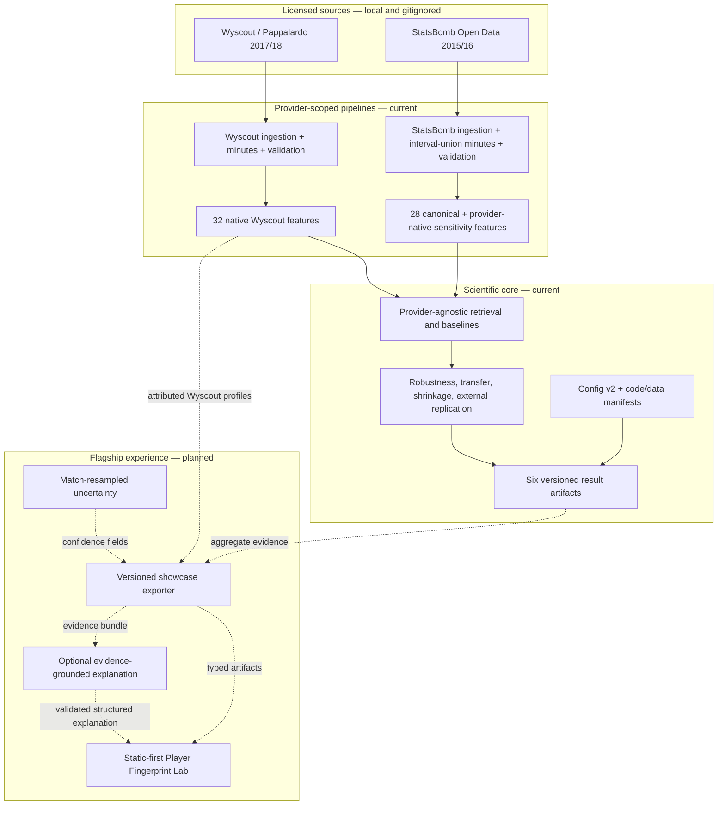

# ScoutLens architecture

**Status:** flagship transition, 2026-07-28. The scientific core and five
published experiments exist; showcase export, web, uncertainty, learned metric,
and AI components below are explicitly marked as planned.

## Architectural thesis

ScoutLens is an evidence system before it is a web application. Provider-native
pipelines turn licensed event data into auditable player-period profiles. A
provider-agnostic evaluation layer tests what those profiles can and cannot
support. Public experiences consume versioned derivatives of that layer; they
do not reproduce analytical logic independently.

The intended product claim is deliberately narrow:

> Event-derived profiles contain temporally stable individual statistical
> fingerprints that can be compared and explained.

Similarity is not proof of playing style, recruitment usefulness, player
quality, causal ability, or transfer success.

## System view

## Current component boundaries

### Provider adapters

`scoutlens.data` and `scoutlens.features` implement the original
Wyscout/Pappalardo path. `scoutlens.statsbomb` is intentionally separate: its
event taxonomy, native coordinates, lineup intervals, and licensing differ.
Sharing ingestion code would obscure those differences rather than remove
meaningful duplication.

The providers meet only after aggregation, through explicit feature-column
lists and a common player-period table contract. The cross-provider comparison
is aggregate: player identifiers do not overlap and no row-level identity link
is asserted.

### Scientific core

`scoutlens.evaluation` receives profiles, roles, feature lists, and experiment
parameters. It owns standardization, similarity, baselines, retrieval metrics,
bootstrap intervals, contextual diagnostics, and experiment runners. This
layer contains no web or LLM dependency.

`config/experiment.json` is the single parameter source for every published
runner. Each result artifact embeds:

- resolved config and its SHA-256;
- git commit;
- whether tracked files differed from that commit;
- a deterministic SHA-256 over the path and bytes of every scientific Python
  module;
- Python, Polars, and platform versions;
- SHA-256 and byte size of every consumed input;
- deterministic seeds and resample counts through the resolved config.

The full drift gate regenerates all six results from local data and compares
their non-volatile content number by number.

### Optional recruitment study

`scoutlens.study` is a completed blinded-material and analysis harness. It is
not part of the flagship critical path: only real expert ratings could support
a recruitment-usefulness claim, and the portfolio experience makes no such
claim. The harness is preserved as an example of pre-registration and a clean
human-in-the-loop boundary.

## Planned flagship boundary

### Showcase exporter

The next component will create small, versioned, public artifacts from
Wyscout-derived aggregates. It will be the only bridge from the scientific
core to the UI. The contract will include schema version, provenance, profile
values, comparison cohort, evidence contributions, caveats, and later
uncertainty fields.

The normative boundary is
[`showcase-artifact-contract.md`](showcase-artifact-contract.md). The product
flow, states, performance budgets, and first implementation cut are in
[`flagship-vertical-slice.md`](flagship-vertical-slice.md).

StatsBomb contributes aggregate replication metrics only. Raw events, lineups,
and per-player StatsBomb feature tables remain local.

### Web experience

The first vertical slice is static-first Next.js with TypeScript. It should be
deployable as HTML/CSS/JavaScript plus versioned data assets, with no database,
authentication, or continuously running Python service. That keeps the public
artifact inexpensive and reproducible while preserving a future seam for a
FastAPI/DuckDB service if genuinely dynamic queries justify one.

### AI trust boundary

The optional LLM is a narrator, never an analytical authority:

1. Python selects the comparison, features, contributions, uncertainty, and
   caveats.
2. A typed evidence bundle is the model's complete factual context.
3. The model returns a structured explanation referencing evidence identifiers.
4. Deterministic validation rejects unknown players, numbers, features, or
   missing mandatory caveats.
5. A local, provider-independent eval suite tests factuality, refusal, caveat
   retention, and degraded inputs.
6. The web experience remains useful when the AI path is absent or disabled.

## Deployment and operational posture

- Research runners are offline batch jobs over local Parquet.
- Published results and showcase data are immutable, versioned build inputs.
- The first web release is a static build; no Kubernetes, message broker,
  vector database, or online feature store is justified.
- CI tests Python 3.11 and 3.14 with a frozen lockfile and runs pytest, Ruff,
  Mypy, and package build gates.
- A backend can be added behind the showcase contract later without changing
  the scientific source of truth or the UI's evidence semantics.

## Quality attributes

| Attribute | Architectural response |
|---|---|
| Scientific auditability | Frozen claims, simple baselines, append-only decisions, machine-readable artifacts |
| Reproducibility | Versioned config, exact source/config/input hashes, dirty-state flag, deterministic seeds, five-run drift test |
| Provider integrity | Separate native adapters and an explicit canonical comparison set |
| Licence safety | Raw data gitignored; Wyscout for public derived profiles; StatsBomb aggregate-only in the showcase |
| Explainability | Feature-level evidence produced before any natural-language layer |
| Low operations | Static-first public deployment and precomputed read-only artifacts |
| Evolvability | Typed showcase boundary can later be served by files, DuckDB, or an API |
| Honest failure | Null results, weaker replications, uncertainty, and unsupported claims remain visible |

## Deliberately absent

The current architecture does not need RAG, autonomous agents, a vector
database, microservices, streaming ingestion, or a live model-training system.
Adding any of them would require a demonstrated use case and a comparison
against the simpler design, following the project's rule that complexity must
earn its place.
