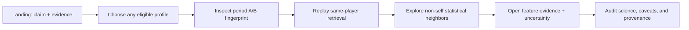

# Player Fingerprint Lab — flagship vertical-slice specification

**Specification:** 1.0.0

**Status:** accepted for implementation

**Decision date:** 2026-07-28

**Tracking:** Beads `scoutlens-jtt.3`; implementation `scoutlens-jtt.4`

## Product thesis

The Player Fingerprint Lab turns the completed feasibility research into a
public, inspectable experience:

> A player's event-derived statistical profile contains a temporally stable
> individual fingerprint. ScoutLens lets people see that fingerprint, replay
> the identity-retrieval test, inspect neighboring profiles, and understand
> exactly where the evidence is strong or weak.

The product is an evidence browser, not a scouting recommender. Its most
important design behavior is that every attractive result travels with its
method, uncertainty, and caveats.

## Audience and jobs

### Primary audience

- technical hiring managers and engineers evaluating the portfolio;
- data scientists and ML practitioners interested in experimental design;
- football-analytics readers who can understand percentiles but do not need to
  know the ScoutLens codebase.

### Primary job

In less than 90 seconds, understand the claim, see one real player fingerprint
across two periods, and know why the result is more credible than a visual
similarity demo alone.

### Secondary jobs

- search the complete eligible Wyscout population and inspect any profile;
- compare a selected player's first-half fingerprint with second-half
  candidates;
- see which feature agreements and disagreements produced a similarity score;
- audit experiment design, external replication, null results, licences, and
  provenance without reading the repository first.

## Non-goals and prohibited implications

The v1 experience does not:

- recommend a signing, replacement, lineup, or transfer;
- rank player quality, potential, value, or tactical fit;
- claim that statistical similarity proves playing style;
- predict transfer success or future performance;
- present the team-aware baseline as a useful recruitment model;
- expose per-player StatsBomb data or any raw provider data;
- require an LLM, backend, login, database, or live data feed.

Product copy must not label a neighbor as a “recommendation”, “replacement”,
“best match”, or percentage “match”. The neutral term is **statistical
neighbor**, and cosine values remain scores in `[-1, 1]`, not probabilities.

## Dataset and population

The first public slice covers the complete Wyscout/Pappalardo 2017/18 Gate-2
population: every player×domestic-competition unit with at least 450 minutes
in both chronological periods. The expected population is 1,257 units under
the frozen experiment config.

A profile key identifies the analytical unit, not merely the human player:
`wy-<player_id>-c-<competition_id>`. This prevents an inter-league transfer
from collapsing two competition contexts into one ambiguous profile.

The catalog is not curated to favor successful retrieval examples. A featured
landing-page profile may be chosen editorially for communication, but the
manifest must name it and mark the choice as editorial. All headline metrics
continue to describe the full frozen population.

## End-to-end user flow

The flow uses three statically generated routes. The selected profile is a URL
query parameter on `/lab`, so a view is shareable without generating 1,257
HTML routes.

## Screen 1 — `/`: evidence-first landing

### Required content

1. One-sentence thesis and an explicit “not a recruitment recommendation”
   qualifier above the fold.
2. A real period-A/period-B fingerprint preview from the declared featured
   profile, with the comparison cohort visible.
3. The Wyscout headline: Baseline A MRR `0.0256` versus fingerprint MRR
   `0.2539`, linked to the method definition and 95% bootstrap interval.
4. The strongest confound beside the headline, not below it: team-aware
   baseline MRR `0.5893` and why same-season club continuity inflates it.
5. External replication: StatsBomb MRR `0.2031`, explicitly lower than the
   Wyscout result and aggregate-only in the public experience.
6. The ratio-shrinkage null result as evidence of model restraint.
7. Primary CTA: “Explore every fingerprint”; secondary CTA: “Audit the
   science”.
8. Source attribution and licence boundary in the page footer.

### Success criterion

A first-time reader can state the supported claim and one unsupported claim
after scanning the page, without opening documentation.

## Screen 2 — `/lab?player=<profile_key>`: Player Fingerprint Lab

### 2.1 Player selector

- Search by player name; filter by nominal role, competition, and team context.
- Search covers all eligible player×competition units, not only featured ones.
- The URL updates on selection and remains reloadable/shareable.
- A transfer or multi-team context lists teams by period instead of inventing a
  single “current team”.
- The active cohort and minimum-minutes rule remain visible near the selector.

### 2.2 Fingerprint view

The primary visualization is an accessible 32-row **fingerprint map**, grouped
into the eight frozen feature families. It uses paired marks for period A and
period B. A radar chart is deliberately excluded: 32 axes hide labels and make
small differences difficult to compare.

Each feature row exposes:

- raw value and unit for both periods;
- global z-score used by the retrieval calculation;
- global and within-role percentiles;
- whether a null was mean-imputed to `z=0` for similarity;
- support information such as minutes and ratio attempts when available;
- later, the match-resampled interval and stability state.

The default display is within-role percentile because it is easier to read as
football context. A visible toggle switches to global percentile. Evidence
drawers always show the global z-scores actually used by cosine similarity so
the explanatory view cannot silently substitute another scale.

No color means “good” or “bad”. Color identifies period and feature family;
position and text carry magnitude.

### 2.3 Identity-retrieval replay

This card explains the actual experiment, rather than retrofitting the result
into a recommendation story:

- query: this profile in chronological period A;
- candidate pool: all eligible period-B profiles;
- expected identity: the same player×competition unit in period B;
- outputs: global self-rank, within-role self-rank, reciprocal rank, and cosine
  score;
- comparison: the role+minutes baseline for the same query;
- later, rank stability under match-level resampling.

Ranks are presented as “the same player appeared at rank N”, never as a player
quality score.

### 2.4 Statistical neighbors

The neighbor list contains the five nearest **other** period-B units to the
selected period-A query within nominal role. Every profile belonging to the
same human player is excluded from this list, even across competitions; the
true same-player profile remains visible in the retrieval-replay card.

Each neighbor card contains identity/context, cosine score, period-B minutes,
the two strongest positive family contributions, the strongest disagreement,
and later a top-five selection stability rate. Selecting a neighbor opens a
comparison drawer; it does not erase the query context.

The drawer shows feature contributions using the exact additive cosine
decomposition. Positive contribution means aligned standardized values —
including low-with-low agreement — and must not be described as a shared
strength. Negative contribution means disagreement, not weakness.

### 2.5 Evidence and caveat rail

The desktop view keeps a concise evidence rail beside the visualization. On
mobile it becomes an inline section after each affected result. Mandatory
caveats are contextual:

- `fingerprint_not_style_proof` beside the fingerprint and neighbors;
- `similarity_not_recruitment` beside the neighbor list;
- `same_season_team_confound` beside identity-retrieval metrics;
- `within_role_display_differs_from_global_model` beside the percentile
  toggle;
- `uncertainty_pending` whenever intervals are not yet available.

Each number can open “How was this computed?”, which links to a stable evidence
identifier and the relevant `/science` section.

## Screen 3 — `/science`: claim, challenge, correction, replication

The science screen tells the research story in decision order:

1. frozen question and chronological split;
2. Baseline A versus the 32-feature cosine fingerprint;
3. within-role control;
4. discovery of the role+team+minutes confound;
5. transferred-player analysis and its small samples;
6. StatsBomb external replication at lower magnitude;
7. empirical-Bayes shrinkage fixing a feature pathology but not retrieval;
8. supported and unsupported claims;
9. complete provenance and links to reports, config, artifacts, and decision
   entries.

Every experiment card reads numbers from `research-summary.json`; the web copy
does not duplicate constants in components.

## Uncertainty behavior

### First vertical slice (`scoutlens-jtt.4`)

The deterministic point-estimate experience ships first. Its artifact must set
`uncertainty.status = "pending"`, and the UI must say that match-resampled
intervals are not yet computed. It must not render a fake zero-width interval
or silently omit the section.

### Flagship v1 (`scoutlens-jtt.5`)

The release adds match-level bootstrap results under the already-versioned
contract:

- freeze the observed eligible cohort before resampling;
- stratify whole-match resampling by competition and chronological period;
- rebuild player minutes, features, the combined-period scaler, similarities,
  and ranks for each replicate;
- use 500 deterministic resamples with seed `1729` for the public build;
- report 95% percentile intervals and valid-replicate counts;
- mark a measure `insufficient` when fewer than 90% of replicates are valid;
- expose raw-value and percentile intervals per feature, self-rank stability,
  and neighbor top-five selection rate.

The bootstrap quantifies sampling stability in this dataset. It is not a causal
confidence interval and does not account for provider annotation error,
unobserved tactics, or future-season drift.

Changing this design requires a decision-log entry and a showcase schema minor
or major version as appropriate.

## System states and fail-closed behavior

| State | Required behavior |
|---|---|
| Initial loading | Fixed-size skeletons preserve layout; controls are disabled and labelled busy |
| Catalog unavailable | Explain that the static data asset failed; offer retry and `/science`; do not show placeholder players |
| Unknown profile key | Keep selector usable, explain that the key is unavailable in this dataset version, and remove it from the URL on next selection |
| Filters return zero | Show the active filters and one-click reset; do not broaden them silently |
| Profile checksum/schema mismatch | Fail closed with dataset version and recovery guidance; never render partially trusted numbers |
| Feature raw value is null | Display “not observed”; show imputation state only in model evidence; never turn it into raw zero |
| Uncertainty pending | Show the declared pending message and point estimates; no interval glyph |
| Uncertainty insufficient | Show valid-replicate count and “too unstable to summarize”; do not suppress the player |
| JavaScript disabled | Landing and science claims/caveats remain readable; the interactive Lab explains that interaction requires JavaScript |

## Responsive and accessibility requirements

- Target WCAG 2.2 AA.
- All routes and Lab actions are keyboard-operable with visible focus.
- Charts have a semantic heading, concise text summary, and accessible table or
  list containing the same values.
- Color is never the only carrier of period, sign, selection, or uncertainty.
- Text and essential graphics meet AA contrast in light and dark themes.
- Touch targets are at least 44×44 CSS pixels.
- Respect `prefers-reduced-motion`; no analytical meaning depends on animation.
- At 360 CSS pixels there is no horizontal page scroll. Feature tables may use
  deliberate internal scrolling with an accessible label.
- At 768 pixels the evidence rail moves inline; at 1,024 pixels it may become a
  sticky secondary column.
- Player search announces result counts and active selection to assistive
  technology.
- English is the only required UI language for the first release; copy lives
  outside components so localization can be added without changing artifacts.

## Performance and privacy budgets

Budgets are measured against a production static build on a simulated mid-tier
mobile device and Fast 4G:

| Budget | Limit |
|---|---:|
| Lighthouse Performance, Accessibility, Best Practices, SEO | each ≥ 90 |
| Largest Contentful Paint | ≤ 2.5 s |
| Interaction to Next Paint | ≤ 200 ms |
| Cumulative Layout Shift | ≤ 0.10 |
| Initial route JavaScript, gzip | ≤ 200 KiB |
| Catalog artifact, gzip | ≤ 400 KiB |
| One player-profile artifact, gzip | ≤ 30 KiB |
| Initial `/lab` transfer excluding fonts | ≤ 750 KiB |

Use self-hosted subset fonts, SVG/CSS for analytical graphics, and no player
photographs in the first slice. There is no ad tech, session replay, cookie
banner, or third-party analytics. If lightweight analytics are later added,
they may record routes and coarse interaction events only; never player search
text or persistent visitor identifiers.

## Acceptance tests

The first vertical slice is complete only when all of the following pass:

1. Exporter output validates against the versioned contract and every manifest
   checksum matches.
2. The catalog contains the frozen expected population; every catalog profile
   resolves to exactly one payload and every neighbor reference resolves.
3. All feature identifiers exist in the feature catalog; numeric JSON contains
   no `NaN` or infinity; nulls follow declared semantics.
4. Neighbor lists exclude the query key, are deterministically ordered, and
   contain the top five within-role period-B candidates from the Python layer.
5. Feature contributions sum to the stored cosine score within `1e-9` before
   display rounding.
6. Required caveat codes exist on every profile and research result they apply
   to.
7. Landing and science headlines equal the five versioned research artifacts;
   no component owns a duplicate numeric constant.
8. End-to-end tests cover desktop and 360-pixel mobile selection, URL reload,
   comparison drawer, filter-empty, unknown-key, missing-artifact, schema-error,
   and uncertainty-pending states.
9. Automated accessibility tests find no serious or critical violations, and
   a manual keyboard pass completes the full selected-player flow.
10. The production static export meets every performance budget above.
11. A clean clone can build the exporter and web app from documented commands
    without raw data only when versioned showcase artifacts are present; raw
    data regeneration remains a separate, documented offline path.

## First vertical-slice cut line

### Included in `scoutlens-jtt.4`

- versioned Python exporter and static Wyscout showcase artifacts;
- the complete 1,257-unit catalog;
- landing, Lab, and science routes;
- period-A/period-B fingerprint map;
- identity-retrieval replay and top-five non-self within-role neighbors;
- exact feature contribution evidence;
- all loading, empty, incompatible-data, and uncertainty-pending states;
- responsive, accessibility, performance, licence, and provenance behavior;
- Next.js App Router, TypeScript strict mode, static export, no backend.

### Explicitly later

- match-resampled uncertainty values (`scoutlens-jtt.5`);
- evidence-grounded AI narration and local evals (`scoutlens-jtt.6`);
- learned representation benchmark (`scoutlens-qop`);
- optional real-scout recruitment study (`scoutlens-h00`, deferred);
- live queries, authentication, saved shortlists, player photos, more seasons,
  multilingual UI, and per-player StatsBomb views.

This cut is intentionally substantial enough to demonstrate product,
scientific, and engineering quality while keeping every advanced layer
optional and independently testable.
